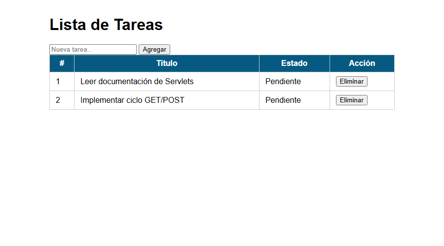
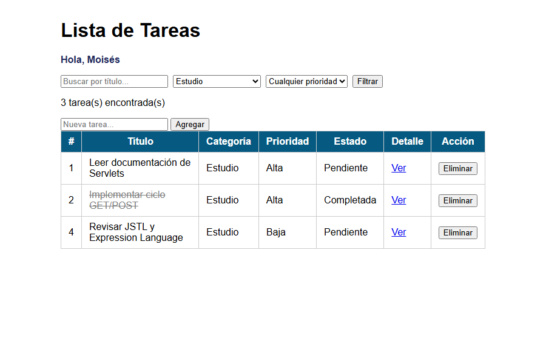
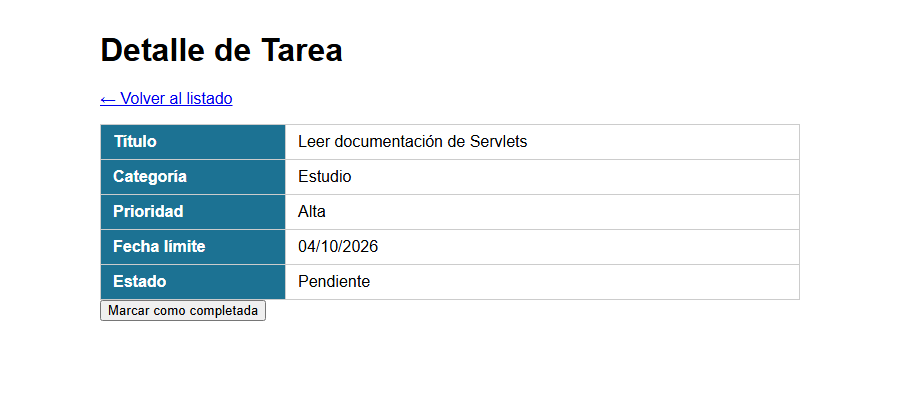

# Post-contenido — Unidad 5: Fundamentos de Java Web (Servlets y JSP)

## Descripción
Repositorio del laboratorio de la Unidad 5 de Programación Web —
Séptimo Semestre. Un único proyecto Maven Web (gestion-tareas) con dos
partes que extienden el mismo dominio de tareas: la Parte 1 construye
el Servlet base con el ciclo GET/POST y el patrón Post/Redirect/Get; la
Parte 2 le agrega filtrado combinado, vista de detalle con un segundo
Servlet, y sesión para personalización y persistencia del filtro.

**Tecnologías:** Java 17, Jakarta Servlet 6.0, JSP + JSTL 3.0, Maven, Apache Tomcat 10.1.

## Estructura del proyecto
```
cardenas-post1-u5/
├── pom.xml
├── README.md
├── img/                                 ← capturas de pantalla
└── src/main/
    ├── java/com/ejemplo/
    │   ├── model/Tarea.java
    │   └── servlet/
    │       ├── TareasServlet.java
    │       └── DetalleTareaServlet.java
    └── webapp/
        ├── css/estilos.css
        ├── WEB-INF/
        │   ├── web.xml
        │   └── views/
        │       ├── tareas.jsp
        │       └── detalle.jsp
        └── index.jsp
```

## Parte 1 — Servlet de gestión de tareas
TareasServlet procesa peticiones GET (listar) y POST (agregar,
eliminar), con validación en el servidor y el patrón Post/Redirect/Get
para evitar el reenvío de formularios.

| Petición | Acción | Resultado |
|---|---|---|
| `GET /tareas` | Listar | forward a `tareas.jsp` |
| `POST /tareas` (`accion=agregar`) | Agregar tarea | redirect a `/tareas` (PRG); si el título está vacío, forward con mensaje de error |
| `POST /tareas` (`accion=eliminar`) | Eliminar por id | redirect a `/tareas` (PRG) |



## Parte 2 — Filtros, detalle y sesión
TareasServlet se extiende con filtrado combinado por texto, categoría
y prioridad, y con las acciones completar e identificar. Se agrega
DetalleTareaServlet, que lee la misma lista de tareas desde
applicationScope y hace forward a una vista de detalle. HttpSession
guarda el nombre del usuario identificado y el último filtro aplicado.

| Petición | Acción | Resultado |
|---|---|---|
| `GET /tareas?q=&cat=&prioridad=` | Filtro combinado | guarda el filtro en sesión y hace forward a `tareas.jsp` |
| `GET /tareas` (sin parámetros) | Restaurar filtro | usa el último filtro guardado en sesión |
| `GET /tareas/detalle?id=X` | Ver detalle | forward a `detalle.jsp`; si el id no es válido o no existe, redirect con mensaje de error |
| `POST /tareas` (`accion=completar`) | Marcar completada | redirect a `/tareas` (PRG) |
| `POST /tareas` (`accion=identificar`) | Guardar nombre en sesión | redirect a `/tareas` (PRG) |

## Decisiones de diseño
- La lista de tareas es una variable de instancia porque es estado
  compartido de toda la aplicación, no un dato de una petición
  individual (ver comentario en TareasServlet). Los datos propios de
  cada petición, como el título recibido en un POST, son variables
  locales del método.
- Se aplica el patrón Post/Redirect/Get en todas las acciones POST
  (agregar, eliminar, completar, identificar): tras procesar el
  formulario se redirige a `GET /tareas`, así recargar la página no
  vuelve a enviar el formulario.
- El filtro activo y el nombre del usuario se guardan en HttpSession,
  no en el request, porque deben sobrevivir a varias peticiones
  distintas (navegación entre /tareas y /tareas/detalle). La lista
  filtrada, en cambio, es solo un atributo de request porque es el
  resultado calculado para esa respuesta.
- DetalleTareaServlet obtiene las tareas desde el ServletContext
  (applicationScope) en vez de duplicar la lista, y usa forward en
  lugar de redirect porque solo necesita entregar un objeto ya
  calculado a una vista, sin generar una nueva petición del navegador.
- TareasServlet se declara con `loadOnStartup = 1` para que su `init()`
  publique la lista en applicationScope al desplegar la aplicación; sin
  esto, abrir `/tareas/detalle` antes que `/tareas` no encontraría la
  lista.
- Los estilos se extrajeron a css/estilos.css al agregar una segunda
  vista (detalle.jsp), para no duplicar el bloque `<style>` de la
  Parte 1 en cada JSP.

## Cómo compilar y desplegar
1. Clonar el repositorio: `git clone https://github.com/Moisex006/cardenas-post1-u5.git`
2. Abrir la carpeta como proyecto Maven en IntelliJ IDEA
3. Ejecutar `mvn clean package` (genera `target/gestion-tareas.war`)
4. Configurar Tomcat Server (Local) en el IDE y desplegar el artefacto
   war exploded de gestion-tareas (o copiar `target/gestion-tareas.war`
   a la carpeta `webapps/` de Tomcat 10.x)
5. Abrir http://localhost:8080/gestion-tareas/tareas

## Capturas de pantalla
Lista con filtro aplicado (categoría Estudio), saludo de sesión y una tarea completada:



Detalle de una tarea con la fecha límite formateada:


